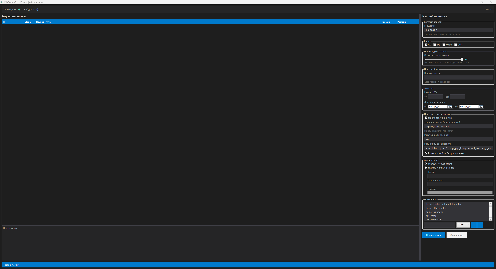

# FileSearchPro — Поиск файлов в локальной сети Windows

[](https://opensource.org/licenses/MIT)
[](https://dotnet.microsoft.com/download/dotnet/8.0)
[](https://www.microsoft.com/windows)
[](https://github.com/andrew-kovrigin/FileSearchPro/stargazers)

**[English](README_EN.md) | Русский**

---

### Быстрая навигация

| Раздел | Описание |
|--------|----------|
| [Возможности](#возможности) | Что умеет программа |
| [Требования](#требования) | Что нужно для запуска |
| [Быстрый старт](#быстрый-старт) | Сборка и запуск |
| [Использование](#использование) | Как пользоваться |
| [Структура](#структура-проекта) | Код проекта |
| [Скачать](https://github.com/andrew-kovrigin/FileSearchPro/releases) | Готовые релизы |
| [Лицензия](LICENSE) | MIT |

---

Инструмент для поиска файлов в локальной сети Windows. Поддержка скрытых шар (C$, D$, ADMIN$), поиск по имени и содержимому, настраиваемые исключения.

## Скриншоты



## Возможности

- **Сканирование сети** — поиск по IP-адресам и диапазонам (192.168.1.1-254)
- **Скрытые шары** — C$, D$, Users, ADMIN$, IPC$
- **Поиск по имени файла** — glob-паттерны (*.pdf, report_*.*)
- **Поиск по содержимому** — несколько слов через запятую, подсветка совпадений
- **Исключения** — папки, файлы, расширения (настраивается)
- **Предпросмотр** — текстовых файлов с подсветкой найденных слов
- **Настройки** — автосохранение всех параметров
- **Производительность** — до 512 потоков, кэширование сети (5 мин)

## Требования

- Windows 10/11
- [.NET 8.0 Runtime](https://dotnet.microsoft.com/download/dotnet/8.0)
- Сетевой доступ к целевым компьютерам

## Быстрый старт

### Сборка

```bash
git clone https://github.com/andrew-kovrigin/FileSearchPro.git
cd FileSearchPro
dotnet build FileSearchPro.sln
```

### Запуск

```bash
dotnet run --project FileSearchPro
```

Или запустите `FileSearchPro.exe` из папки `bin\Debug\net8.0-windows\`

## Использование

1. Введите IP-адреса или диапазон в поле «Сетевые адреса»
2. Выберите шары для поиска (C$, D$, Users)
3. Настройте шаблон имени файла или включите поиск по содержимому
4. Нажмите «Начать поиск»

### Примеры IP-диапазонов

| Формат | Описание |
|--------|----------|
| `192.168.1.1-254` | Все адреса от .1 до .254 |
| `10.0.0.1,10.0.0.2` | Конкретные адреса |
| `172.16.0.1-50` | Подсеть |

### Поиск по содержимому

1. Включите галочку «Искать текст в файлах»
2. Введите слова через запятую: `password, пароль, ключ`
3. Настройте расширения для поиска и исключения
4. Совпадения подсвечиваются жёлтым в предпросмотре

## Структура проекта

```
FileSearchPro/
├── [FileSearchPro.sln](FileSearchPro.sln)
├── [README.md](README.md)
├── [README_EN.md](README_EN.md)
├── [LICENSE](LICENSE)
├── [.gitignore](.gitignore)
└── [FileSearchPro/](FileSearchPro/)
    ├── [App.xaml](FileSearchPro/App.xaml)
    ├── [MainWindow.xaml](FileSearchPro/MainWindow.xaml) — Интерфейс
    ├── [MainWindow.xaml.cs](FileSearchPro/MainWindow.xaml.cs) — Логика UI
    ├── [Models/](FileSearchPro/Models/)
    │   ├── [SearchConfig.cs](FileSearchPro/Models/SearchConfig.cs)
    │   ├── [ExclusionRule.cs](FileSearchPro/Models/ExclusionRule.cs)
    │   ├── [SearchResult.cs](FileSearchPro/Models/SearchResult.cs)
    │   └── [NetworkTarget.cs](FileSearchPro/Models/NetworkTarget.cs)
    ├── [Services/](FileSearchPro/Services/)
    │   ├── [NetworkScanner.cs](FileSearchPro/Services/NetworkScanner.cs) — Сканирование сети
    │   ├── [FileSearchService.cs](FileSearchPro/Services/FileSearchService.cs) — Поиск файлов
    │   ├── [ExclusionService.cs](FileSearchPro/Services/ExclusionService.cs) — Исключения
    │   ├── [AuthService.cs](FileSearchPro/Services/AuthService.cs) — Авторизация
    │   └── [SettingsService.cs](FileSearchPro/Services/SettingsService.cs) — Настройки
    └── [settings/](FileSearchPro/settings/)
        └── [exclusions.json](FileSearchPro/settings/exclusions.json)
```

## Лицензия

[MIT](LICENSE)

---

**Tags:** `network file search` `C# WPF application` `search files by IP` `Windows network scanner` `find files in network` `hidden shares search` `C$ D$ access` `file content search` `grep network` `search text in files`

